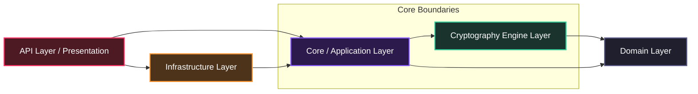

<div align="center">
  

  <h1>CryptoKeyLab</h1>
  <p><strong>The Ultimate Cryptography-as-a-Service (CaaS) Platform</strong></p>

  <p>
    <a href="https://github.com"></a>
    <a href="https://microsoft.com"></a>
    <a href="https://github.com"></a>
    <a href="https://github.com"></a>
  </p>

  <p>
    <strong><a href="#-overview">Overview</a></strong> •
    <strong><a href="#-architecture">Architecture</a></strong> •
    <strong><a href="#-supported-algorithms">Algorithms</a></strong> •
    <strong><a href="#-quick-start">Quick Start</a></strong> •
    <strong><a href="#-api-reference">API Reference</a></strong> •
    <strong><a href="#-license">License</a></strong>
  </p>
</div>

***

## ⚡ Overview

> Modern application security demands both ironclad compliance and raw performance. CryptoKeyLab bridges this gap by delivering a high-performance, stateless, metadata-driven cryptographic engine exposed via a unified, sub-millisecond RESTful API. Built for developers who refuse to compromise between speed and security.

CryptoKeyLab abstracts the complexity of implementing low-level cryptographic primitives. By combining an enterprise-grade .NET 9 engine with a dynamic database-driven orchestration layer, it provides instant access to over 115+ cryptographic algorithms through a secure, globally scalable gateway.

### Key Features
* **Sub-Millisecond Engine:** Stateless execution designed for high-throughput, low-latency microservices.
* **100% OCP Compliant:** Dynamically loads algorithms at runtime using a Reflection-based Factory pattern driven by database metadata.
* **Zero-Trust Security:** Built-in Action Filter gatekeeper. API keys are cryptographically isolated and only stored as one-way SHA-256 hashes.
* **Atomic Rate-Limiting:** Distributed Cache-Aside pattern supporting Redis and localized InMemory providers.
* **Resilient Infrastructure:** Dedicated background workers handle token bucket resets, coupled with global structured error sanitization via `IExceptionHandler`.

---

## 🏗️ Architecture

CryptoKeyLab is engineered around a strict **Clean Architecture** paradigm within a monorepo structure. This guarantees complete decoupling of business rules from database frameworks and delivery mechanisms.



### Layer Breakdown
* **Domain:** Contains pure enterprise entities, exceptions, and value objects. Zero external dependencies.
* **Cryptography Engine:** The algorithmic core. Implements the Reflection-based Factory pattern to resolve primitives dynamically.
* **Core (Application):** Orchestrates application flow, command/query handling, and abstract caching contracts.
* **Infrastructure:** Manages data access via SQL Server using high-throughput **Dapper** and native Stored Procedures. Houses `LimitResetWorker` background routines.
* **API (Presentation):** Net 9.0 Minimal APIs exposing endpoints, Scalar/OpenAPI schemas, and the Zero-Trust security filter.

---

## 🔐 Supported Algorithms

CryptoKeyLab natively supports **115+ algorithms**. Click below to expand the enterprise registry.

<details>
<summary><b>View Hashing & Key Derivation Functions (KDFs)</b></summary>

* **Secure Hashing:** SHA-224, SHA-256, SHA-384, SHA-512, SHA3-256, SHA3-512, BLAKE3, Whirlpool, SM3, GOST R 34.11-2012.
* **Password Hashing & KDFs:** Argon2id, bcrypt, scrypt, PBKDF2.
* **MAC Variants:** HMAC-SHA256, HMAC-SHA512, KMAC128, KMAC256.
</details>

<details>
<summary><b>View Symmetric & Asymmetric Encryption</b></summary>

* **Symmetric Ciphers:** AES-128-GCM, AES-256-GCM, AES-256-CBC, ChaCha20-Poly1305, Camellia, ARIA, SM4.
* **Asymmetric Ciphers:** RSA-2048, RSA-4096 (OAEP/PSS padding support).
* **Elliptic Curve & Post-Quantum:** ECC (secp256k1, Edwards Curves), CRYSTALS-Kyber-768 (Quantum-Resistant).
</details>

<details>
<summary><b>View Encoders & Secure Generators</b></summary>

* **Data Binary Encoders:** Base32, Base64, Base64URL, Base58 (Bitcoin alphabet), Hexadecimal.
* **Identifiers & Tokens:** UUIDv4, UUIDv7 (time-ordered), NanoID, Cryptographically Secure Pseudo-Random Passwords (CSPRNG).
</details>

---

## 🚀 Quick Start

### Prerequisites
* [.NET 9.0 SDK](https://microsoft.com)
* [SQL Server](https://microsoft.com) (or Docker instance)
* Redis (Optional, defaults to InMemory caching)

### Installation & Setup

1. **Clone the repository:**
   ```bash
   git clone https://github.com
   cd CryptoKeyLab
   ```

2. **Configure Environment Variables:**
   Update the connection strings and caching preferences in `src/CryptoKeyLab.Api/appsettings.json`:
   ```json
   {
     "ConnectionStrings": {
       "DefaultConnection": "Server=YOUR_SERVER;Database=CryptoKeyLabDb;Trusted_Connection=True;TrustServerCertificate=True;"
     },
     "CacheSettings": {
       "Provider": "Redis", 
       "RedisConnectionString": "localhost:6379"
     }
   }
   ```

3. **Initialize Database & Run Migrations:**
   ```bash
   dotnet ef database update --project src/CryptoKeyLab.Infrastructure --startup-project src/CryptoKeyLab.Api
   ```

4. **Launch the Engine:**
   ```bash
   dotnet run --project src/CryptoKeyLab.Api
   ```
   The interactive Scalar API sandbox will be available at `http://localhost:5000/scalar/v1`.

---

## 🔌 API Reference

### 1. Provision an API Key
Generate an isolated client access credential. The plain text token is returned exactly *once* and stored downstream as a one-way SHA-256 hash.

* **HTTP Method:** `POST`
* **Endpoint:** `/api/v1/auth/keys`

#### Request Payload
```json
{
  "clientName": "Enterprise-Gateway-Production",
  "rateLimitTier": "Premium"
}
```

#### Response Payload (201 Created)
```json
{
  "clientId": "d7b2a9f4-3091-4e73-b26a-982cb1b0e142",
  "apiKey": "ckl_live_7f8a9b2c3d4e5f6a7b8c9d0e1f2a3b4c5d6e7f8a9b",
  "status": "Active",
  "createdAt": "2026-06-27T01:20:00Z"
}
```

### 2. Compute a Cryptographic Hash
Execute high-performance, stateless transformations over the secure runtime engine.

* **HTTP Method:** `POST`
* **Endpoint:** `/api/v1/crypto/hash`
* **Headers:** `X-API-Key: ckl_live_7f8a9b2c3d4e5f6a7b8c9d0e1f2a3b4c5d6e7f8a9b`

#### Request Payload
```json
{
  "algorithm": "BLAKE3",
  "payload": "The quick brown fox jumps over the lazy dog",
  "encoding": "Hex"
}
```

#### Response Payload (200 OK)
```json
{
  "algorithm": "BLAKE3",
  "hash": "2d3d977f726a849b23b185f4b4ef3b3a0e681c6a6f6580f55b11267b2d56a312",
  "executionTimeMs": 0.12
}
```

---

## 📄 License

Distributed under the GNU License. See [LICENSE](LICENSE) for more information.

***

<div align="center">
  <p>Built with ⚡ by <a href="https://github.com">Vishal Yadav</a></p>
</div>
